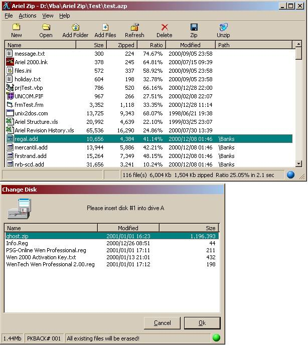

<div align="center">

## Ariel Zip Compression Utility with Disk Spanning V1\.0


</div>

### Description

A powerful and very quick compression program using the 32bit zlib.dll (V1.1.3) compression library originally written by Jean-loup Gailly and Mark Adler (variation of LZ77 Lempel-Ziv 1977 algoritm). The application is implemented through an extensive ArielZip class and a Winzip like client interface.

Features

* Powerful and very fast - compresses 6000 kb data files to 1500 kb (25%) in 2.1 seconds! * Multiple disk spanning with automatic sensing of disk capacity * User friendly floppy disk change dialogue showing contents of disk to be overwritten * Single and multiple file extraction * Extracted icons included in archive as bitmaps * 9 compression levels * Add folders and subfolders through recursive scanning of FSO objects * Add files with multiple file selection * Delete files from list and archive * Refresh files * File association of .azp extension with default icon using regobj.dll (included in zip file).

Other Programming Features

- About box referencing application object (revision etc)

- Custom Folder browse control implementing BrowseForFolder (ArielBrowseControl)

- Extensive use of FileSystemObject (requires scripting runtime dll)

- Automatic sensing of floppy disk insertion/removal

- Demonstration of toolbar control

- Small icon extraction using SHGetFileInfo calls in shell32.dll lib

- Extensive usage of CopyMem (Kernel32)

- Access the system temp folder through GetTempPath (kernel32)

- Registering of azp file type and associated default icon through regobj.dll

- Ini file manipulation using GetProfile and SaveProfile functions

Credits and links: see readme.txt file
 
### More Info
 


<span>             |<span>
---                |---
**Submitted On**   |2001-01-04 00:20:28
**By**             |[Tom de Lange](https://github.com/Planet-Source-Code/PSCIndex/blob/master/ByAuthor/tom-de-lange.md)
**Level**          |Intermediate
**User Rating**    |4.7 (282 globes from 60 users)
**Compatibility**  |VB 5\.0, VB 6\.0
**Category**       |[Complete Applications](https://github.com/Planet-Source-Code/PSCIndex/blob/master/ByCategory/complete-applications__1-27.md)
**World**          |[Visual Basic](https://github.com/Planet-Source-Code/PSCIndex/blob/master/ByWorld/visual-basic.md)
**Archive File**   |[CODE\_UPLOAD13332132001\.zip](https://github.com/Planet-Source-Code/tom-de-lange-ariel-zip-compression-utility-with-disk-spanning-v1-0__1-14087/archive/master.zip)

### API Declarations

```
'Requirements (included in zip file)
'Ariel Browse Folder.ocx
'Registry manipulation (regobj.dll)
'Scripting runtime (scrrun.dll)
'Zip File size: 242kb
```


